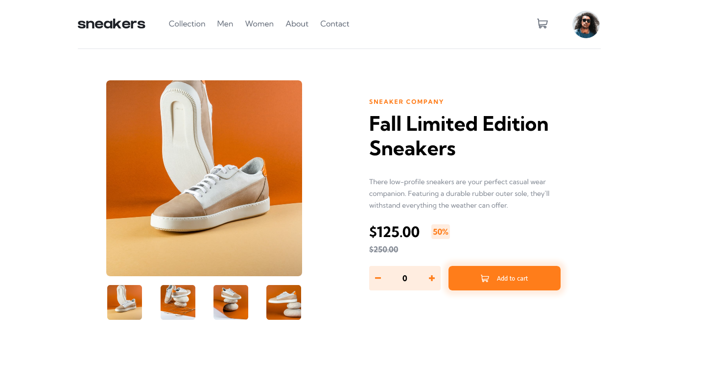

# Frontend Mentor - E-commerce product page solution

This is a solution to the [E-commerce product page challenge on Frontend Mentor](https://www.frontendmentor.io/challenges/ecommerce-product-page-UPsZ9MJp6). Frontend Mentor challenges help you improve your coding skills by building realistic projects.


## Table of contents

- [Frontend Mentor - E-commerce product page solution](#frontend-mentor---e-commerce-product-page-solution)
  - [Table of contents](#table-of-contents)
  - [Overview](#overview)
    - [The challenge](#the-challenge)
    - [Screenshot](#screenshot)
    - [Links](#links)
    - [Built with](#built-with)
    - [What I learned](#what-i-learned)
    - [Continued development](#continued-development)
  - [Author](#author)


## Overview


### The challenge

Users should be able to:

- View the optimal layout for the site depending on their device's screen size
- See hover states for all interactive elements on the page
- Open a lightbox gallery by clicking on the large product image
- Switch the large product image by clicking on the small thumbnail images
- Add items to the cart
- View the cart and remove items from it

### Screenshot



### Links

- Live Site URL: [Github Pages](https://brukkk.github.io/product-info/)


### Built with

- Semantic HTML5 markup
- CSS Sass custom properties
- Flexbox
- CSS Grid


### What I learned

Implementing Sass Nested properties is is such a great choice instead of vanilla Css. Makes easy to search where code was writen.


```scss
.some-element-with-border {
  border: 3px solid transparent;

  &:hover{
    border: 3px solid $color;
  }
}

```


### Continued development

- [x] Desktop website
- [x] Desktop Style
- [x] Shopping-cart
- [ ] Lightbox Image Gallery
- [ ] Responsive mobile
- [ ] Order-buttons-interaction


## Author

- Portfolio - [Bruk](https://brukkk.github.io/bruk/)
- Frontend Mentor - [Bruk](https://www.frontendmentor.io/profile/Brukkk)
- Twitter - [BruksT](https://twitter.com/BruksT)
